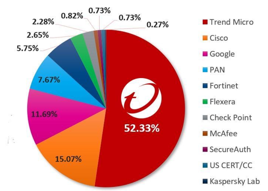

### workload security

Cloud one workload security  is part of the Trend Micro Cloud One™ security service platform,it designed to secure your workloads at runtime for any of those environments (physical,virtual,cloud and container) securely by offering multiple  advantages that have been listed below:

1-Automated:  
Security as code lets your DevOps teams bake security into their build pipeline to release continuously and frequently. With built-in automation, including automated discovery and
deployment, quick-start templates, and our Automation Center, secure your environment and meet
compliance requirements quickly.   

2-FLEXIBLE:  
Cloud one workload security gives you multiple options for cloud builders to secure their environments and we support hybrid cloud,multi-cloud,multi-service environments.   

3-ALL-IN-ONE SOLUTION:  
Cloud one workload security is one service out of cloud one platform that gives you unified detection and response through one platform with complete necessary requirements to increase your security posture and accelerate your compliance.  

### Why does it matter that Trend is the leader?  

Faster time to protection for our customers. Instantaneous protection at the time of vulnerability release vs. other security companies who then need to react and build protection. Time matters!

### Understanding How Trend Micro Can Help to Secure Your workloads

#### Runtime security  
Any workloads that use the power of the cloud, hybrid cloud, virtual, and container. Workload Security allows customers to secure their workloads capabilities by integrating AWS accounts to cloud one workload security console, so in the dashboard, you can see all the workloads and you can start the protection journey through seven modules:

- <b>Anti-malware</b>:
The Anti-Malware module protects your Windows and Linux workloads against malicious software, such as malware, spyware, and Trojans. Powered by the Trend Micro™ Smart Protection Network™, the Anti-Malware module helps you instantly identify and remove malware and block domains known to be command and control servers.

- <b>Intrusion prevention</b>:
The Intrusion Prevention module inspects incoming and outgoing traffic to detect and block suspicious activity. This prevents exploitation of known and zero-day vulnerabilities. Workload Security supports "virtual patching": you can use Intrusion Prevention rules to shield from known vulnerabilities until they can be patched, which is required by many compliance regulations. You can also configure Workload Security to automatically receive new rules that shield newly discovered vulnerabilities within hours of their discovery. This module can protect your workloads against web applications until code fixes can be completed.

- <b>Firewall</b>:
The Firewall module is for controlling incoming and outgoing traffic and it also maintains firewall event logs for audits.

- <b>Web Reputaion</b>:
The Web Reputation module provides content filtering by blocking access to malicious domains and known communication and control (C&C) servers used by criminals. The Web Reputation module taps into the Trend Micro Smart Protection Network, which identifies new threats quickly and accurately.

- <b>Integrity Monitoring</b>:
The Integrity Monitoring module provides the ability to track both authorized and unauthorized changes made for the workloads and it will help you to make there are non-legitimate changes that may lead to comprise your cloud environment.

- <b>Log Inspection</b>:
The Log Inspection module captures and analyzes system logs to provide audit evidence for PCI DSS or internal requirements that your organization may have.

- <b>Application control</b>:
The Application Control module monitors changes - "drift" or "delta" - compared to the computer’s original software. Once application control is enabled, all software changes are logged and events are created when it detects new or changed the software on the file system. When Deep Security Agent detects changes, you can allow or block the software, and optionally lock down the computer.

### Architecture of cloud one  workload Security

Cloud one Workload security architecture was built to be simple to understand and monitor all of your workloads with peace of mind.

we will Dig a little deeper into the architecture details, let's go :bullettrain_side: :

- <b>Workload Security console</b>:  
Centralized web-based management console that administrators use to configure security policy and deploy protection to the enforcement components, the Deep Security Agent.  

- <b>Deep Security Notifier</b>:  
 it  is a security agent deployed directly on a computer which provides Application Control, Anti-Malware, Web Reputation service, Firewall, Intrusion Prevention, Integrity Monitoring, and Log Inspection protection to computers on which it is installed.

- <b>Deep security agent software</b>:   
This software will be installed in workload to provide porper security protection for your workload.

- <b>Deep security relay</b>:   
A Deep Security Relay is an agent that is configured to redistribute Deep Security software and security updates to other agents.This helps your deployment scale.

To learn more about workload security, visit <a href="https://cloudone.trendmicro.com/docs/workload-security/">cloud one workload security Documentation</a>
