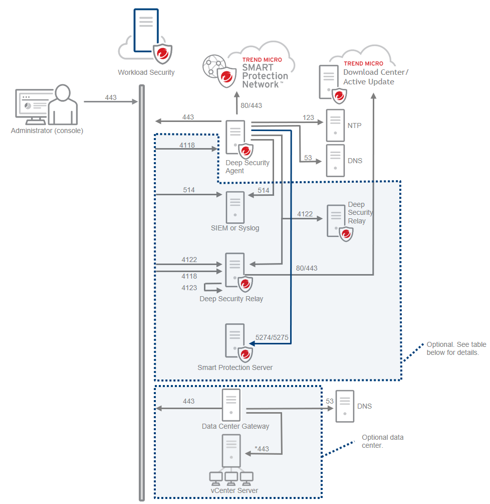

# Cloud one Workload security service Workshop:

### Requirements

* A Cloud One Account. [Sign up for 30-day free trial now](https://cloudone.trendmicro.com/SignUp.screen) if it's not already the case!

* An <b>AWS Account</b> with <b>AdministratorAccess</b> permission, [Sign up here](https://portal.aws.amazon.com/billing/signup#/start) if it's not already the case! You can learn about the <b>AdministratorAccess</b> permissions [here](https://docs.aws.amazon.com/IAM/latest/UserGuide/getting-started_create-admin-group.html)

* Amazon Elastic Compute Cloud (Amazon EC2)  that we will use in this workshop, if you don't have one, you can learn how to create one [here](https://docs.aws.amazon.com/AWSEC2/latest/UserGuide/concepts.html)

* Enable <b>agent-initiated activation</b> and communication  
-Before you install agent in workload make sure to Allow Agent-Initiated Activation  
-Enable agent-initiated activation
-Go to Administration > System Settings > Agents.  
Select Allow Agent-Initiated Activation.  
-Select Allow Agent to specify host name.  
-From the If a computer with the same name exists list.  
-Select Re-activate the existing workload.  
-Click Save.
* Ports for <b>communication between agent and workload security console</b> 
Default Requirements:  
-Agent-to-manager communication requires you to open the outbound TCP port (443 or 80, by default).   
-Manager-to-agent communication requires you to open an inbound TCP port (4118).
-you will need to go to security group in AWS to enable these ports,to know more about security group inaws visit this  [here](https://docs.aws.amazon.com/AWSEC2/latest/WindowsGuide/ec2-security-groups.html).  
you can also see all ports of workload security that have been shown below.

To learn more about System requirements, visit <a href="https://cloudone.trendmicro.com/docs/workload-security/system-requirements/">System Requirements</a>
