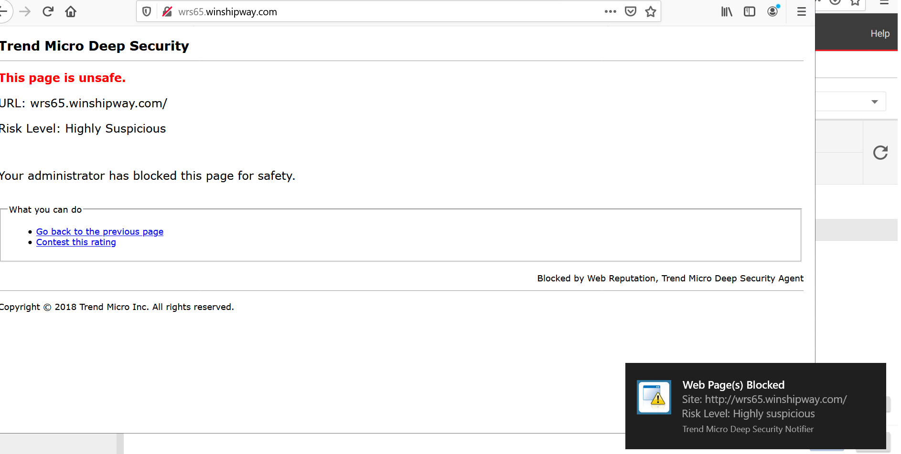

### Test Anti malware & Web reputation modules 

Since workload security has seven modules, we want to test some of these modules (anti-malware, web reputation).
To test these modules, you'll need to generate some events detection using the EICAR file and malicious URL from winshipway.

**Anti-malware module test:**

1-Go to the <a href="https://www.eicar.org/?page_id=3950">EICAR</a> file page and download ```eicar_com.zip``` or any of the other versions of this file.  
2-the popup message will appear like this.

3- you can see the logs from cloud one workload console go to computers-> double click into test workload machine->click anti-malware module->click Anti-malware-events.
  

**Web Reputation module test:**  

1-Go to this test website http://wrs65.winshipway.com  
2-The pop-up message will appear like this.

3-you can see the logs from cloud one workload console go to computers-> double click into test workload machine->click web reputation module->click Web reputation-events.


{}
<p style='text-align: left;'>
Remember to assign a policy to test workload before you test it!!
</p>
{}
