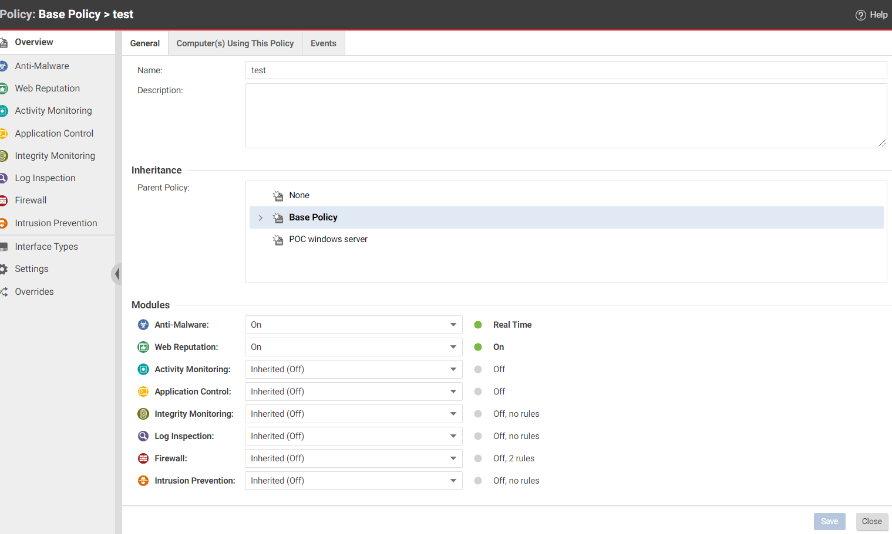
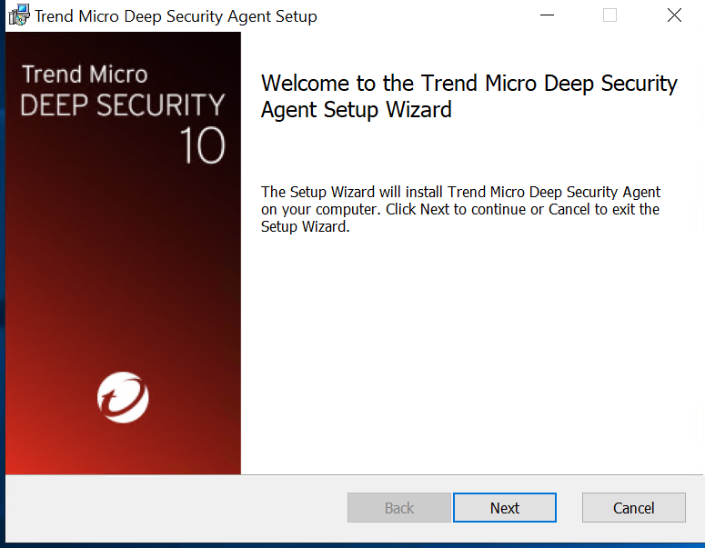

# Deployment

In this section we will learn how to add an AWS account to see all workloads in AWS environments then secure it from bad guys :skull: , First of all, make sure that all the requirements are met, then: 
Go to Cloud One workload dashboard page,here:```https://cloudone.TrendMicro.com/workload/deployment``` , it will request the login information for the Cloud One platform,in case you don't have it, check the requirements page that has all the details that you will need.


On the workload security dashboard click "Computers" then click add and select ```add AWS account Wizard``` to synchronize your workloads within Cloud one workloads security. 


After click Add AWS cloud account,the wizard will appears and you will see two setup types:  

1-Quick.  
2-Advanced.

In this workshop, we will use quick setup since this option is the easiest way to add an AWS account because it uses a Cloudformation template to quickly automate the process of setup.  

### Steps to add AWS account 
 
 ```Note:make sure to signed in into your AWS account before these steps.```

1-In the Workload Security console, go to Computers and click Add > Add AWS Account.  
2-select Quick.


3-Click next.  
4-Click next,A page appears that describes what happens during the setup process with a URL. The URL is valid for one hour.


5-Click next.  
6-It will automatically navigate to AWS  -> Cloudformation 


7-click next.  
8-click next.  
9-click next.  
10-On the Review page, select the check box next to I acknowledge that this template might cause AWS CloudFormation to create IAM resources.  
11-Click create a stack.  
12-Let's give cloud formation template doing his job for several minutes :ghost:.   
13-After that you can see the result of Adding your AWS account, go to the workload security dashboard, then click computers, in the left-hand side you can see your AWS account and your workloads that have been imported from your AWS account.


  


### create  policy 
When you create a policy in the cloud one workload security will allow a bunch of rules and configuration settings to be saved in the policy module for easier assignment to multiple workloads. You can use the Policy editor to create and edit policies that you can then apply to one or more workloads. You can also use a policy editor per workload (which is very similar to the Policy editor) in case you want to apply a specific workload, but the recommended method is to create specialized policies rather than edit the settings per workload level.

1-In the workload security dashboard click policies.  
2-Click new-> new policy.  


3-Create test policy and Inherit from base policy.  
4-Click next.  
5-Click next.  
6-Select the workloads you want to implement this policy then click next.  
7-It will shows you the 7 modules you have multiple options enable it(on) or disable it (off) or inherited from the parent policy in this case(base policy).  
8-Enable Anti malware and web reputation then click next.   
9-Click next.  
10-Click finish.  
11-Click close.  
12-The test policy dashboard will appear.



### Install Deep security agent
In this section, we will use the install manually option.  
1-In workload security console click administration.  
2-On the left-hand side click updates->software->Local.  
3-In this workshop will test on windows 2019 base 64-bit workload machine.  
4- select the latest installer.  
5-Right click and select export installer.  
6-Installer will be downloaded.  
7-Navigate this installer MSI package to the workload machine powered by windows server 64 bit.  
8-Run the installer MSI.  
9-Follow the wizard page instructions and keep all things as default.  


10-The deep security notifier will pop-up in workload Desktop.  
11-Go back to deep security console and then assign a policy to this workload.
To learn more about create policy and how to assign policy to workload,visit <a href="https://cloudone.trendmicro.com/docs/workload-security/policy-create/#Assign">Create a policy and assign to workload </a>  

To learn more about install agent options, visit <a href="https://cloudone.trendmicro.com/docs/workload-security/agent-install/#install-the-agent-using-other-methods">Install the agent</a>  


congratulations!!    
You have now completed the adding AWS Account ready to fly   :dash: :trollface: so let's test some modules of workloads security :eyes:..